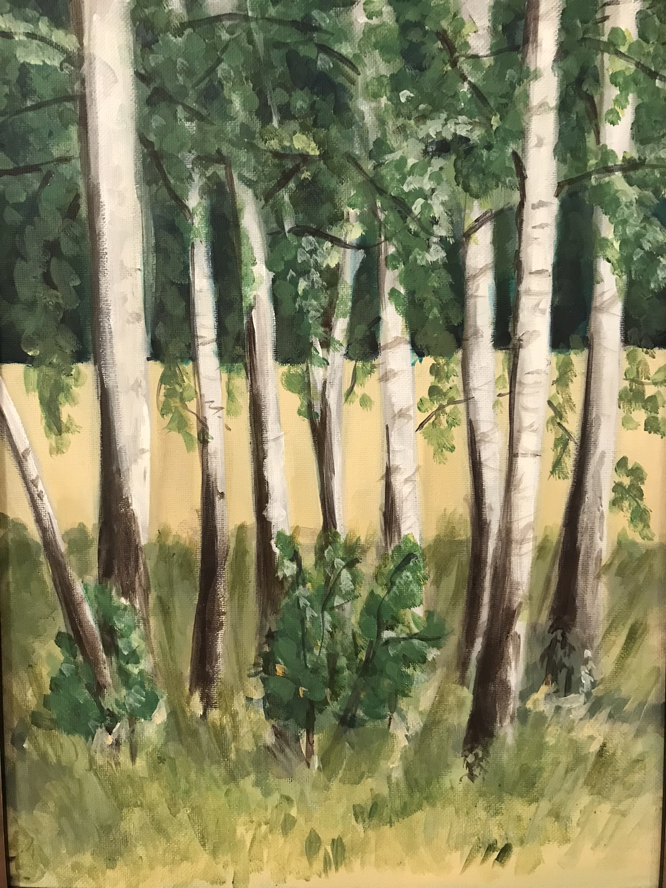

## Różności

Twierdza Chocim (akryl na płótnie, 91x64)

Dzbanek (akryl na płótnie)

Tuje

Brzozy (akryl na płótnie)

Postać (rysunek węglem na papierze)

Dłonie (rysunek węglem na papierze)

<a href="https://pawelciosmak.github.io/portfolio">Wstecz</a>

